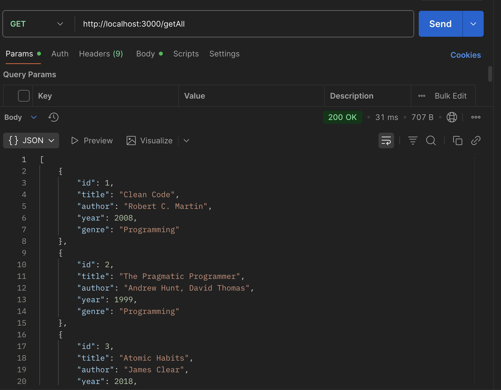
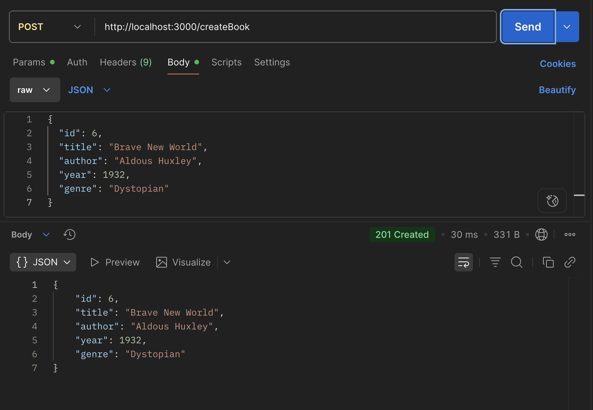
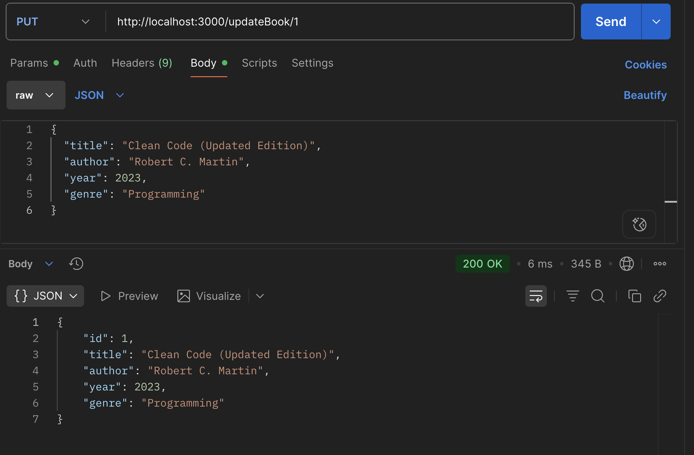
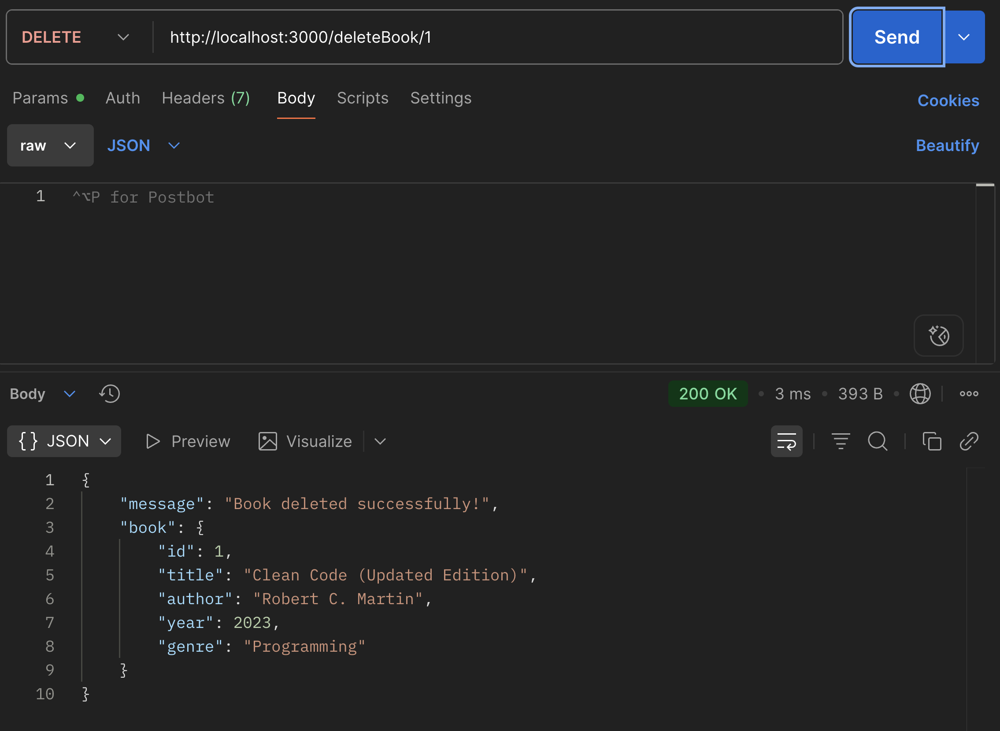

# 📚 Book Catalog API

## Endpoints
- **GET** `/getAll` → Fetch all books from the catalog  

- **POST** `/createBook` → Add a new book to the catalog  

- **PUT** `/updateBook/:id` → Update details of a book by its ID  

- **DELETE** `/deleteBook/:id` → Delete a book from the catalog by its 
ID

